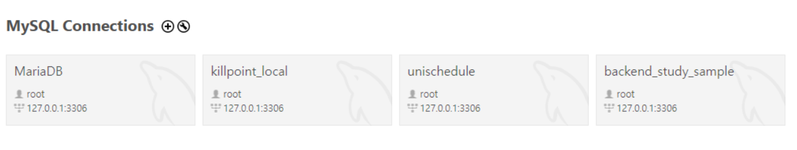
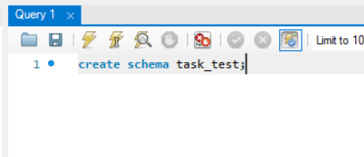
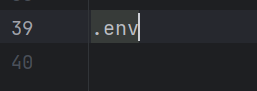

# 할 일 목록 관리 CRUD 구현
> 해당 예제에서는 JPA 및 MySQL을 사용합니다. JDBC로 직접 SQL문을 사용하셔도 되고 MySQL에 익숙하지 않으시다면 H2 데이터베이스를 사용하셔도 됩니다.

### Task 도메인

- id
- title
- description
- dueDate
- priority
- status (Enum)

## DB 연결 및 Gradle 설정

### 의존성 추가

> dependency에 JPA와 MySQL 관련 의존성을 추가하고 코끼리를 눌러줍니다.

```gradle
dependencies {
	implementation 'org.springframework.boot:spring-boot-starter-web'
	// 이번 예제에서는 JPA를 사용합니다!
	implementation 'org.springframework.boot:spring-boot-starter-data-jpa'
	// DB는 mysql을 사용합니다!
    runtimeOnly 'com.mysql:mysql-connector-j'
	testImplementation 'org.springframework.boot:spring-boot-starter-test'
	testRuntimeOnly 'org.junit.platform:junit-platform-launcher'
}

```


### DB 연결

1. MySQL Workbench에서 +를 눌러 connection을 생성합니다.
   
2. DB 이름을 정해서 create schema를 수행합니다.
   
3. application.properties와 .env 파일 살펴보기

> properties에 다음 정보를 추가합니다.
```properties
# DB 접속정보
spring.datasource.url=${DATASOURCE_URL}
spring.datasource.username=${DATASOURCE_USERNAME}
spring.datasource.password=${DATASOURCE_PASSWORD}
# DB 드라이버
spring.datasource.driver-class-name=com.mysql.cj.jdbc.Driver

spring.jpa.hibernate.ddl-auto=update
# true로 설정하면 실제 호출되는 sql문을 콘솔에서 확인할 수 있습니다.
spring.jpa.show-sql=true
spring.jpa.properties.hibernate.dialect=org.hibernate.dialect.MySQL8Dialect
```

{ }로 표시된 항목들은 환경변수로, .env파일을 통해 주입해줘야 합니다.

이를 위해, 프로젝트 루트 폴더에 .env 파일을 만들고 다음 내용을 추가합니다.

이 때, 플러그인을 설치하라는 창이 보이면 설치하는 것이 좋습니다. 설정 적용하기 편합니다.

```.env
# task_test 대신 여러분이 만든 DB 이름을 넣으면 됩니다.
DATASOURCE_URL=jdbc:mysql://localhost:3306/task_test?useSSL=false&useUnicode=true&serverTimezone=Asia/Seoul&allowPublicKeyRetrieval=true
# 사용자명
DATASOURCE_USERNAME=
# 비밀번호
DATASOURCE_PASSWORD=

```

마지막으로 .gitignore에 .env를 추가해줍니다.


DB 접속 정보 등 민감한 정보가 GitHub에 올라가지 않도록 하기 위해 이런 방식을 사용합니다.

DB 연결까지 정상적으로 완료되었습니다.

만약 .env파일이 제대로 불러와지지 않는다면
[참고](https://strnetwork.tistory.com/54)

- 히히
